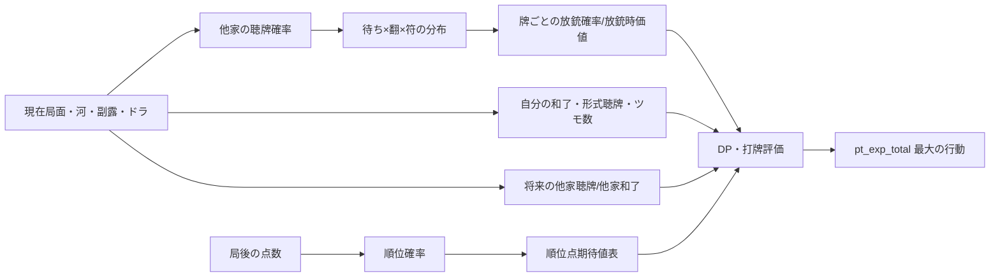

# Akochan の推定モデル・期待値・パラメータ

この文書は、`ai_src` に実装された「見えない情報の推定」と「推定結果から順位点期待値を作る」処理を、ソースコードを開かずに追えるように書き下したものです。対象は主に [`tenpai_est.*`](../akochan/ai_src/tenpai_est.cpp)、[`tenpai_prob_calc.*`](../akochan/ai_src/tenpai_prob_calc.cpp)、[`exp_values.*`](../akochan/ai_src/exp_values.cpp)、[`jun_calc.*`](../akochan/ai_src/jun_calc.cpp)、[`betaori.*`](../akochan/ai_src/betaori.cpp)、[`selector.*`](../akochan/ai_src/selector.cpp) と、将来値を DP に渡す [`tehai_cal_supl.cpp`](../akochan/ai_src/tehai_cal_supl.cpp) です。

## 1. まず全体像

Akochan は、局面を「次のツモで何を引くか」だけで評価しません。未知の他家手牌を確率分布に置き換え、和了・放銃・流局・順位変動を同じ単位（順位点）へ変換してから候補手を比較します。



「聴牌率」と「待ち・翻・符」は別の確率です。例えば他家について、まず `P(聴牌)` を求め、聴牌していると仮定した分布として `P(待ち牌, 翻, 符)` を作り、最後に掛け合わせて放銃確率へします。現在の局面を一人麻雀として探索する `Tehai_Calculator` の値は、これらを相手の攻撃・流局・順位モデルで補正して利用します。

## 2. 共通の数式とファイル読み込み

### 2.1 ロジスティック回帰

二値の確率は、特徴量 `x` と重み `w` の内積をシグモイドへ通して作ります。

```text
a = Σ wi xi
P = σ(a) = 1 / (1 + exp(-a))
```

`x[0]` はほぼ常に `1`（切片）です。`tenpai_prob`、`agari_prob`、`ryukyoku_prob`、`keiten`、`other_end_prob`、`betaori` などがこの形式です。ファイルの重みは係数の並びだけで、列名・標準化情報・学習データは保存されていません。

### 2.2 多クラス softmax

順位の24通りの順列や他家和了者の3通りは、クラスごとに内積を計算して softmax にします。

```text
a_c = Σ wd,c xd
P(c) = exp(a_c) / Σk exp(a_k)
```

`MC_logistic` は指数をそのまま計算します。最大値を引いてから指数化する安定版 `MC_logistic_mod` もありますが、順位推定・`result_other` の実行経路は前者です。極端な入力でのオーバーフロー対策はありません。

### 2.3 `read_parameters` の契約

[`mjutil.cpp`](../akochan/ai_src/mjutil.cpp) の `read_parameters(w, NPara, path)` は、相対パスのテキストから最大 `NPara` 個の浮動小数点を読みます。

- ファイルがない、または `NPara` 個に満たない場合は `assert` で停止します。
- `NPara` 個を超える値は、その呼び出しでは無視されます。
- パスは `params/...` で固定されており、実行時カレントディレクトリがリポジトリの `akochan` ルートであることを前提にします。
- `_4000`、`_9000`、`_3000` 等はファイル名の一部であり、実行時にサンプル数として解釈されません。

`my_logit` は通常の logit と違い、入力が `x<=0` なら `-10`、`x>=1` なら `10` に丸めます。従って、確率0/1を別途扱わないモデルでも有限の値になります。

## 3. パラメータの体系

リポジトリの `params/` には、モデル別に **709ファイル**あり、すべて `ako/` 配下です。数値の個数は推論コードの `read_parameters` 呼び出しで決まり、代表的な内訳は次の通りです。

| ディレクトリ | 実際のファイル数 | 重み数/ファイル | 用途と選択軸 |
|---|---:|---:|---|
| `tenpai_prob` | 131 | 5（通常）、5/3（染め手） | 副露数・河枚数。通常64、染め手 `somete` 67 |
| `tenpai_after` | 302 | 2 | 現在河枚数×将来河枚数。通常153、リーチ用149 |
| `other_end_prob` | 111 | 3 | 現在/将来河枚数。通常66、リーチ用45 |
| `agari_prob` | 17 | 4 | 自分の河枚数（実行時は1〜15へ丸める） |
| `my_keiten_prob` | 18 | 3 | 自分の河枚数（0〜17） |
| `other_keiten_prob` | 18 | 2 | 自分の河枚数（0〜17）と他家の現在聴牌率 |
| `ryukyoku_prob` | 26 | 4 | 非リーチ13、リーチ13。自分の河枚数・他家リーチ・他家聴牌 |
| `tsumo_num` | 16 | 4 | 自分の河枚数1〜16 |
| `houjuu_prob` | 9 | 3 | 自分の河枚数6〜14。誰からロンされるかの補正 |
| `result_other` | 12 | 21（7×3） | 他家の和了者3クラス。河枚数 |
| `rank_prob` | 12 | 96（4×24） | 東1〜東4相当の0〜7は `_9000`、それ以降は `_nn` |
| `betaori` | 17 | 3 | ベタオリ時の放銃率補正、河枚数2〜18 |
| `inclusive_fold` | 17 | 3 | DP内の包括的な降り補正、河枚数2〜18 |
| `ron_ratio` | 3 | 3/3/6 | リーチ・非リーチ・ダマのロン率補正 |

この表のファイル数は現在のツリーを確認した結果です。将来ファイルを追加しても、コードが選択する範囲外なら値は使われません。特に `agari_para16/17.txt` は存在しますが、`cal_my_agari_prob` の選択範囲1〜15からは外れています。

## 4. 他家の現在状態を推定する

### 4.1 聴牌確率の大枠

`Tenpai_Estimator_Simple::set_tenpai2` が各プレイヤーの `tenpai_prob` を作ります。

1. リーチ宣言済みなら `1.0`。
2. `tenpai_prob_est == "instant"` なら `0.25 × 副露数`（4副露は1.0）です。
3. `tenpai_prob_est == "ako"` なら通常手と染め手を混ぜます。

染め手の混合は、色 `c`（萬子・筒子・索子）ごとに

```text
s_c       = その色の染め手である確率
t_c       = s_c × 染め手として聴牌している確率
p_normal  = (1 - s_萬 - s_筒 - s_索) × 通常手の聴牌率
p_tenpai  = p_normal + t_萬 + t_筒 + t_索
```

です。`s_c` は副露があり、リーチしておらず、既存副露がその色＋字牌だけで構成可能な場合にだけモデルを呼びます。3色のモデル出力を確率単体として足しており、合計を1へ再正規化したり、負の通常成分を0へ切り詰めたりはしません。相互排他性は手牌の意味から期待しているだけです。

### 4.2 通常手モデルの特徴量

`infer_tenpai_prob_ako` は、対象の副露数 `fn` と河の長さ `kn` で `fuuro{fn}_para{clamped_kn}_4000.txt` を選びます。特徴量は次の5個です。

| 位置 | 特徴 |
|---:|---|
| 0 | 1（切片） |
| 1 | 手出し枚数（ツモ切りでない捨て牌数） |
| 2 | 他家リーチ後に対象が捨てた枚数。対象がその後チー/ポンすると `-1` にされる |
| 3 | 字牌＋么九牌の「種類」数 |
| 4 | 2/8、3/7、4/6、5の「種類」数 |

河枚数の下限は、副露0/1が2、副露2が3、副露3が7、上限は18です。副露0だけは出力を最大 `0.12` に制限し、副露1以上はモデル出力をそのまま返します。副露4はファイルを読まず1.0です。

`infer_tenpai_prob_ako_old` は別の9特徴・固定重みモデルです。

```text
[1, 副露数, 手出し数,
 字牌種類数, 1/9種類数, 2/8種類数,
 3/7種類数, 4/6種類数, 5種類数]
```

これは現行の他家聴牌率の本体ではなく、主に期待ツモ数モデルから参照されます。したがって「現在聴牌率」と「ツモ数計算に使う古い聴牌率」は一致しないことがあります。

### 4.3 染め手モデルの特徴

`get_somete_feature` は河を走査し、対象色または字牌でない連続区間の最大長、その区間より前に色牌/字牌が出たか、最後の手出しが色牌/字牌かを特徴にします。`somete_fuuro{1,2,3}_para...` の5重みロジスティック回帰です。

染め手としての将来聴牌率は、`get_somete_tenpai_post_feature` の

- 字牌を1種類でも捨てた種類数
- 対象色の牌を1種類でも捨てた種類数

を3重みモデルへ入力します。副露数別の河枚数範囲はファイル名で分かれます。染め手候補でない場合は、前段の `s_c=0` により最終値への寄与が消えます。

## 5. 他家の待ち・打点分布

### 5.1 何を出力するか

各他家について、次の3次元配列を作ります。

```text
H[牌][翻][符]
```

これは「その人が聴牌していると仮定したとき、どの牌を待ち、何翻何符で和了するか」の重みです。ツモ用、通常のロン用、今この捨て牌でロンできる用（`hai_ron_prob_now`）の3種類があります。

### 5.2 副露なし/リーチの待ち形係数

対象がリーチ中、または副露0の場合は、実際の手牌を復元せず `Machi_Coeff` を使います。

`mc_init` は初期形係数、`katachi_est` は待ち形（両面・双碰・単騎・嵌張/辺張）の割合です。

| モード | 初期待ち形割合 `[両面, 双碰, 単騎, 嵌張/辺張]` |
|---|---|
| `instant` | `[0.50, 0.25, 0.05, 0.20]` |
| `ako` | おおむね `[0.60, 0.122, 0.08, 0.243]` を出発点に調整 |

`ako` では両面候補の残数に応じて両面割合を `hosei[0..18]`（残数が多いほど1に近い）で減らし、残り3形へ比例配分します。初期値の合計は1.045で、1へ丸める処理はありません。

形ごとの係数には次の補正を順番に掛けます。

- 対象の河で捨てた牌・リーチ前に捨てた牌・見逃し牌を待ち候補から除外。
- 見えている枚数が多い牌を弱め、双碰は2枚以上見えたら、単騎は3枚以上見えたら0にする。
- 両面は両端のどちらかが4枚見えたら0、3枚なら0.5、2枚なら0.8。嵌張・辺張も同様。
- `sbr_est == "ako"` では、リーチ前に捨てた牌の近傍へ固定倍率を掛ける。
- `tas_est == "ako"` では、最終手出し後に残った両面/嵌張/辺張候補ごとに、河の種類数特徴7個の固定ロジスティック回帰を掛ける。ファイルではなくソース内の重みです。

最後に `std_coeff` が形を正規化します。双碰は係数総和を **2**、単騎は1、両面は「両端へ同じ係数を足す」ため、確率配列は単純な「待ち牌の確率分布」ではなく、待ちの発生量（incidence）です。この後、翻符分布を含めて全体を正規化する場所と、牌別放銃率としてそのまま使う場所が分かれている点に注意が必要です。

### 5.3 副露手の再帰列挙

対象がリーチしておらず、副露が1つ以上ある場合は `Tehai_Estimator` が隠れ手牌を組合せ列挙します。

1. 残り牌 `nokori` から刻子、順子、雀頭を再帰的に選ぶ。
2. 最後に両面・嵌張・辺張・双碰・単騎の待ちを1枚/2枚仮定する。
3. 和了形ごとに役・翻・符を近似計算する。
4. 牌種ごとの組合せ数の積 `Π combination(残り枚数, 使用枚数)` を重みにする。
5. 和了形が2件未満の候補は重みを0.2倍する。

列挙上限は `tehai_max_num = min(7, 13 - 副露数×3)` です。候補に待ちがなく、役がない、または見逃し牌を待ちに含む候補は落ちます。`prob_now` は見逃し判定をさらに適用した「今の捨て牌に対してロン可能な分布」です。

推定役は一般形の厳密な点数計算ではありません。清一色/混一色、断么九、混老頭、字一色、純全帯么九/混全帯么九、対々和、三色同刻/同順、一気通貫、役牌、三暗刻、三槓子、大三元/小三元、大四喜/小四喜などを形の成立条件だけで加算します。リーチ・門前清自摸和・一発などの相手の宣言情報はこの列挙で完全には再現されません。符は20符から始め、鳴き刻子/槓、暗刻、役牌雀頭、待ち形を足します。

`tenpai_check` は最終形の `han>0` だけを残すため、「形は和了だが役なし」の候補は相手のロン分布から除外されます。

なお、`ako` でない分岐の `prob_now` 正規化には実装上の注意があります。通常の総和 `den` と「今ロン可能」だけの総和 `den_now` を計算しますが、後者を割る際にも `den_now` ではなく `den` を使います。`ako` の `normalize2` 分岐は別の分母を使うため、モードによって `prob_now` の総和が異なり得ます。

### 5.4 翻符への変換とドラ

待ち形係数に `Tactics` の `hanfu_weight_tsumo` または `hanfu_weight_ron` を掛けます。デフォルトは次の疎な分布です。

```text
ツモ: 3翻30符 0.4、4翻30符 0.5、6翻30符 0.1
ロン: 2翻30符 0.1、3翻30符 0.5、4翻30符 0.4
```

副露手の実計算では、ツモは符へ2符を足して10符単位へ切り上げ、ロンは10符単位へ切り上げ（20符相当は30符へ）ます。`cal_hai_prob_from_machi_coeff` のロン経路では、待ち牌の周辺のドラ枚数に応じて翻分布を上へシフトし、赤5は通常5の分布を1翻上乗せして赤5インデックスへ追加します。ツモ経路にはこの赤5追加はありません。

このため、赤5・両面の両端・双碰の2待ちが、処理上は「同じ通常牌1枚」として扱われる箇所と、「追加の和了候補」として質量が増える箇所があります。これは牌の厳密な確率ではなく、放銃推定に合わせた近似です。

### 5.5 最終的な牌別放銃量

`cal_houjuu_hai_prob_value` は相手 `i`、牌 `h` ごとに次を作ります。

```text
q_i(h) = Σhan,fu H_i(h,han,fu)
v_i(h) = Σ H_i(h,han,fu) × PT_i(my_pid, han, fu) / q_i(h)
```

`PT_i` は「その相手がその翻符で和了した後、自分が得る順位点期待値」です。`q_i(h)=0` のとき `v_i(h)=0` です。

全他家を合成すると、

```text
Q(h) = min(1, Σi≠自分 P_tenpai(i) × q_i(h))
V(h) = Σi≠自分 P_tenpai(i) × q_i(h) × v_i(h)
       / Σi≠自分 P_tenpai(i) × q_i(h)
```

です。相手間の独立性から `1-Π(1-p)` を作るのではなく単純加算して最後に1で上限処理します。上限処理は価値の分母には遡って適用されません。

## 6. 数巡先の相手状態と DP

### 6.1 将来聴牌率（`tenpai_after`）

`set_tenpai_prob_other` は DP の各残りツモ数に対し、現在の河枚数 `act_num1` と将来の河枚数 `act_num2` を渡します。`act_num2 <= act_num1` は現在値をそのまま返します。それ以外は

```text
x = [1, logit(現在聴牌率)]
P(将来聴牌) = logistic(w[act_num1][act_num2], x)
```

です。通常モデルは `act_num1=1..17`、`act_num2=2..18`、リーチ用は `1..15` と `3..18` に丸めます。`instant` はすべての将来時点で現在の聴牌率を維持します。

対象以外にリーチ者が1人でもいる場合、コードは通常モデルを使わず全員をリーチ用 `reach_tenpai_after` へ置き換えます。設定にある `tenpai_after_use_other_reach` はこの判定には参照されません。

### 6.2 途中の他家和了（`other_end_prob`）

`set_other_end_prob` は「その時点までに他家が局を終わらせる確率」を各 DP 段階へ置きます。

- `instant`: 通常・リーチとも各段階を `0.1`。
- `ako`: 非リーチ他家の現在聴牌率から
  `1 - Π(1-P_tenpai)` を作り、特徴 `[1, 他家リーチ数, その和]` を3重み回帰へ入れる。

ファイルは通常 `other_end_para{現在河}_{将来河}_4000.txt`、リーチ用 `reach_other_end_para{...}_1000.txt` です。DP では、各ステップで

```text
P(残る) × 通常の手進行値 + P(他家終了) × other_end_value
```

へ混ぜます。累積ハザードの厳密な生存分析として再正規化はしません。

### 6.3 DP 内のロン率補正（`ron_ratio`）

`ron_ratio_est == "ako"` のとき、DP が「その牌を引いた後に鳴き/ロンの選択肢を取る」経路へ係数を掛けます。

- まず `1 + 2 × pon_ron_flag`。ポンを伴う候補は3倍です。
- ダマの門前非リーチは、字牌または5からの距離で6個の固定 `dama_ron_ratio` を選び、オッズ `p/(1-p)` に変換。
- それ以外は、リーチ中なら `[1, 自分の牌別放銃率, 他家将来聴牌率の総和]`、非リーチなら `[1, 自分の聴牌率×牌別放銃率, 同じ総和]` を `reach_ron_ratio_para4000` / `not_reach_ron_ratio_para4000` へ入力し、出力確率をオッズへ変換。

配列は5要素で宣言されていますが、ファイルから読むのは3要素です。従ってファイル名の「重み数」とC++の一時配列の大きさは一致しません。

この補正は「実際にロンされる確率」そのものではなく、DP の遷移候補を比較するための相対係数です。`ron_ratio_est == "instant"` はこの回帰を行わず、ポン/ロンの3倍係数だけを返します。それ以外は停止します。

### 6.4 DP の一時状態

`Tehai_Calculator::calc_DP` は、各候補・残りツモ数ごとに次を保持します。

- `agari_prob`: 自分が将来和了する確率
- `tenpai_prob`: 局終了時に形式聴牌である確率
- `agari_exp`: 自分の和了による順位点期待値
- `ten_exp`: 和了しない場合も含めた終局価値
- `ori_exp`: ベタオリへ切り替えた場合の価値

各ツモ候補を残り牌枚数で重み付けし、引いた牌を通す/放銃する分岐を入れ、他家終了を混ぜ、最後に `ori_exp` が大きければ降り状態へ置換します。`norisk_ratio` は `exec_calc_DP` 内で0.0に固定されており、設定の `norisk_ratio_if_other_reach` はこの経路では働きません。

## 7. 自分の和了・流局・形式聴牌・ツモ数

### 7.1 自分の和了確率

一人麻雀探索の生値を `agari_prob_sol` とします。`cal_my_agari_prob` は次の例外を先に適用します。

- 直前イベントが自分のツモ。
- 他家リーチなし。
- 自分が門前。
- 他家最大副露数が `use_agari_coeff_tp_fnm` 以下。
- 自分の河枚数が `use_agari_coeff_tp_an` 以下。

すべて満たす場合は生値をそのまま返します。デフォルト設定は副露上限0、河上限8なので、序盤の門前・他家攻撃なしだけが対象です。

例外外では、`instant` は `0.5 × agari_prob_sol`、`ako` は

```text
x = [1,
     他家リーチ人数,
     非リーチ他家の少なくとも1人が聴牌する確率,
     logit(agari_prob_sol)]
```

を `agari_para{1..15}.txt` へ入力します。返された補正後の確率を `my_agari_prob` と呼びます。

和了時の価値は、探索値が「和了と非和了の混合値」なので、元の生確率で条件付き価値へ戻します。

```text
my_agari_value =
  (value_sol - (1 - agari_prob_sol) × value_not_agari)
  / agari_prob_sol
```

生確率0なら0です。重要なのは、分母にも補正後確率にもせず、**生確率**を使っていることです。したがって `agari_prob_sol` と `my_agari_prob` の補正差が大きいと、条件付き価値と最終確率の組合せは厳密な再推定ではありません。

### 7.2 残りツモ数

`cal_tsumo_num_exp` は残りの自分の手番を整数へ丸めます。`dahai_inc` と引数 `tenpai_prob` はシグネチャにありますが、現行実装では `dahai_inc` は使わず、`tenpai_prob` も古いモデル経路では使いません。

- `instant`: `ceil(max(18 - 自分の河枚数, 0) × 0.7)`。
- `ako`: 自分の河枚数を1〜16へ丸め、`tsumo_num/ako/para{河}_4000.txt` の4重みを使う。特徴は `[1, 他家リーチ数=1, 他家リーチ数>=2, 非リーチ他家の「少なくとも1人が聴牌」確率]` です。この確率は `1 - Π(1-P_tenpai)` です。

非DP・ルールベース等で `cal_exp`/ベタオリへ渡す値は、統計モデル値と物理山から計算した `cal_tsumo_num_DP`（残り70ツモを座順で割る）の `min` です。一方、DP 分岐は `cal_tsumo_num_DP` の物理値を直接使います。従って統計モデルが山の残りを越えることはありません。

### 7.3 流局確率

`cal_ryuukyoku_prob` は「自分が和了しなかった場合に流局する確率」です。

- `instant`: `1 - 0.75 × max(18 - 自分の河枚数 - dahai_inc, 0) / 18`。
- `ako`: `ryukyoku_prob/ako` の通常またはリーチ用ファイル。序盤（行動数6以下）は実数の行動数と他家リーチ有無、後半は他家リーチ0/1/2以上の区分、いずれも非リーチ他家の「少なくとも1人聴牌」を入力します。

確率を0〜1へ再クリップする処理はありません。`instant` の局序盤は0ではなく0.25から始まる、という意味で物理流局率ではありません。

### 7.4 形式聴牌（流局時テンパイ）

自分はリーチ中なら1.0です。

- `instant`: 一人麻雀探索値 `keiten_prob_sol` の0.6倍（0なら0）。
- `ako`: `my_keiten_prob/ako/para{河}_4000.txt` へ `[1, 探索値, 他家リーチが1人以上か]`。

他家はリーチ中なら1.0です。

- `instant`: 常に0.5。
- `ako`: `other_keiten_prob/ako/para{河}_4000.txt` へ `[1, 対象の現在聴牌率]`。

他家用ファイルの河枚数は対象の河ではなく **自分（`my_pid`）の河枚数**で選択されます。意図か実装上の取り違えかはコードだけでは判断できませんが、状態依存モデルとしては注意が必要です。

4人の形式聴牌状態は独立なベルヌーイとして16通り列挙されます。

```text
P(flag) = Πpid (flag[pid] ? keiten_prob[pid]
                              : 1 - keiten_prob[pid])
```

各パターンのテンパイ料点数移動後に順位を推定し、その加重和を `ryuukyoku_value` にします。自分をノーテン扱いにした同じ計算が `cal_noten_ryuukyoku_value` です。

## 8. 局結果を順位点期待値へ変換する

### 8.1 順位予測（`rank_prob`）

`calc_jun_prob` は、局後の4人の点数を受け取り、各プレイヤーの1〜4着確率を返します。

`ako` モデルは、起家からの相対順に並べた点数 `score[0..3]` に対し、

```text
x = [1, (score[0]-score[1])/10000,
        (score[0]-score[2])/10000,
        (score[0]-score[3])/10000]
```

を使います。4特徴×24クラスの96重みで、24個の着順順列へ softmax を掛けます。東1相当から7局目までは `para0..7_9000.txt`、それ以降は `para8..11_nn.txt` を読みます。`_nn` は名前に反して、実行時には96個の線形softmax重みとして扱われ、Chainer等のニューラルネットワークを呼びません。

softmaxクラスは相対座順上の順列で、最後に `mod_pid(kyoku, oya, pid)` で実プレイヤーIDへ戻します。決定的なフォールバックや `instant` では、点数の降順、同点時は起家からの座順で着順を決めます。

統計モデルを使う条件は、概ね次の範囲です。

- `kyoku < 8` で全点数が0以上。
- または `kyoku < 12` で全点数が0以上かつ30000未満。

条件外は決定的順位です。親の連荘終了でトップが確定する場合も決定的順位です。`kyoku_mod_next == 4` 付近のデータ不足を示すコメントはありますが、補間や別モデルへの切替はありません。

### 8.2 和了後の順位点テーブル

`cal_kyoku_end_pt_exp` は次の添字を持つ表です。

```text
kyoku_end_pt_exp[和了者][放銃者/ツモなら和了者][翻][符インデックス]
```

翻1〜13、符インデックス1〜11を走査し、合法でない組合せ（例：ロンの20符、1翻の平和ツモ、低翻の七対子）を0にします。5翻以上は符が点数へ影響しないため、符インデックス2の値をコピーします。`ten_move_hora` で点数移動を計算し、次局の点数へリーチ供託の未受理分も反映します。その点数から `calc_jun_prob` を呼び、**自分の順位点** `[jun_pt[0..3]]` の期待値を格納します。

リーチ宣言直後の仮想評価では `reach_mode=true` とし、自分の未受理1000点を一度引き、和了者へ供託を加える経路も別表にします。`use_other_end_ar` が真なら他家終了価値にもこの別表を使います。

### 8.3 流局後の順位点テーブル

`cal_ryuukyoku_pt_exp` は4人の形式聴牌ビット `[t0,t1,t2,t3]` を16通り列挙し、`ten_move_ryukyoku` のテンパイ料移動後に同じ順位推定をします。親がテンパイなら連荘、そうでなければ次局として計算します。

ここで `riibou`（供託本数）を数える変数は作られますが、流局点数移動関数へ渡されません。流局で供託が次局へ持ち越される扱いは、少なくともこの順位点表の計算には入りません。これは通常の対局精算を完全に再現したものではありません。

### 8.4 5種類の局結果と最終期待値

`cal_kyoku_result_prob` は5要素（自分和了、他家3人の和了、流局）を作ります。

```text
P(自分和了) = my_agari_prob
P(流局)     = (1 - my_agari_prob) × ryuukyoku_prob
P(他家和了) = (1 - my_agari_prob) × (1 - ryuukyoku_prob)
              × 他家和了者分布
```

他家和了者分布は次の2方式です。

- `instant`: 他家の聴牌率を合計して比率配分。全員0なら均等1/3。
- `ako`: `result_other` の3クラスsoftmax。自分から見た相対座順ごとに、`[1, 各相手のリーチ有無3個, 各相手の非リーチ聴牌率3個]` の7特徴を使い、21重みを読みます。自分の河枚数7以下は `para1_6_4000`、それ以降は7〜17へ丸めます。

他家が和了するときの放銃者分布は `cal_target_prob` です。

- `instant`: 和了者自身からのツモ相当を5/11、各他家からのロンを2/11。
- `ako`: 自分から放銃する確率を、行動数6〜14の3重みファイルへ `[1, 相手ごとのベタオリ危険度, 自分の副露数+増分]` として入力する。ただし実際の呼び出しは `logistic(w,x,2)` であり、**3番目の副露数特徴 `x[2]` を無視**します。行動数4以下は自分への2/11固定。残りを相手自身5/9、その他2/9へ配分します。

上記の3重みファイルを読みながら2特徴で回帰するのは、ファイル個数と数式の二重管理が残っている例です。

`cal_target_value` は自分和了なら `my_agari_value` をそのまま使い、相手和了ならツモ分布/ロン分布と `kyoku_end_pt_exp` を翻符ごとに積分します。最終的な1候補の評価は、

```text
E = Σ結果 P(結果) × V(結果)
```

であり、点棒そのものではなく順位点の期待値です。

## 9. ベタオリ（`betaori`）

`Betaori` は、残った手牌から安全そうな牌を順に切り、一定回数の打牌で放銃しない/放銃する期待値を近似します。赤5は通常5へまとめて比較します。

牌を `h`、手牌内枚数を `n`、牌別放銃確率を `p(h)`、牌別放銃時価値を `v(h)` とすると、リスクの順位係数は次です。

```text
β = 1 - 0.9^n
risk_coeff = p(h) × (other_value - v(h))
             / (p(h) + β - p(h)×β)
```

係数の小さい順に牌を選び、`ori_num` 枚分（枚数単位）まで、

```text
放銃確率 += 残存係数 × p(h)
価値     += 残存係数 × p(h) × v(h)
残存係数 *= (1-p(h)) × 0.9^n
```

と進めます。残りは `other_value` とします。0.9の固定減衰は、同じ牌を複数枚切る相関・安全度の逓減をまとめた近似です。

`betaori_est == "instant"` は非和了価値を `other_value=not_agari_value` としてそのまま使います。`ako` は `other_end_value` と受動的流局価値を使い、`betaori_houjuu_para{2..18}_3000.txt` の3重みで

```text
[1, 副露数, logit(元のベタオリ放銃確率)]
```

へ補正を掛けます。補正後の放銃部分を `p_mod / p` で拡大縮小し、非放銃部分を
`流局確率×ノーテン流局価値 + (1-流局確率)×他家終了価値` で埋めます。元の放銃確率が0なら、流局/他家終了の混合値だけです。

DP 内の包括降りは同じ形式の `inclusive_fold/ako` ファイルを使い、通常の最終候補評価の `betaori` と役割を分けています。

## 10. `selector` での接続

`Selector::set_selector` は、概ね次の順で値を組み立てます。

1. `cal_kyoku_end_pt_exp` と `cal_ryuukyoku_pt_exp` で、和了/流局後の順位点表を作る。
2. 4人の `Tenpai_Estimator_Simple` を作る。
3. 他家ごとの牌別放銃確率・価値、および全他家合成値を作る。
4. 自分の非和了価値、他家終了価値、受動的流局価値、期待ツモ数を作る。
5. シャンテン数と局面で DP を使うか決める。
6. 各打牌/リーチ/槓/鳴き/ロン/パスの `pt_exp_after` を計算する。
7. 実際に今切る牌の危険度を一段外側から混ぜ、`pt_exp_total` を作る。
8. `pt_exp_total` の降順で並べ、先頭を返す。

打牌系の最終式は、牌 `h` を今切ったとき、

```text
pt_exp_total(h) = Q_now(h) × V_now(h)
                   + (1-Q_now(h)) × pt_exp_after(h)
```

です。暗槓は直ちに捨てないため `pt_exp_after` をそのまま使います。鳴きは鳴いた後に切る牌について同じ式を使い、通常時と「鳴く前の残りツモ数」の2通りを計算して小さい方を採用します。

他家の攻撃がある場合、非DP分岐でも `pt_exp_after_ori` が `pt_exp_after` より大きければ後者を降り価値へ置き換えます。高シャンテンの `rule_base_decision` へ入ったときは、通常のモデル評価をせず、九種九牌・ベタオリ・孤立牌のルールを返す場合があります。

## 11. 設定ファイルと読込経路

### 11.1 setup の違い

[`setup_match.json`](../akochan/setup_match.json) は4人分の `tactics` 配列を持ち、自己対局の各プレイヤーへ対応する要素を設定します。[`setup_mjai.json`](../akochan/setup_mjai.json) は1つの `tactics` オブジェクトを持ち、`set_tactics_one` が4人へ複製します。現行の両ファイルは、ほぼすべてのモデル選択を `ako`、`jun_pt` を `[90,30,-30,-90]`、基底を `default` にしています。

`set_tactics` は4要素の配列でなければ `assert`、`set_tactics_one` はオブジェクトの存在を要求します。

### 11.2 二つの設定経路

設定は一つの構造体へ完全にコピーされるわけではありません。

- `Tactics::set_from_json` は `base` を選び、DP・候補列挙・槓・翻符分布・`betaori_est` など構造体フィールドを初期化/上書きする。
- モデル選択の多くは共有配列 `tactics_json[pid]` を各関数が直接参照する。

そのため、JSONへキーを書いても、`Tactics` が読むか、直接参照されるかのいずれかでなければ効果はありません。

### 11.3 `base` の初期値

| `base` | 手替わり `tegawari_num`（0〜6シャンテン） | 候補数制限 | ツモ列挙制限 |
|---|---|---|---|
| `default` | `[2,2,1,1,0,0,0]` | 無制限、鳴き局面も無制限 | 常時列挙、上限20000 |
| `light` | `[2,1,1,0,0,0,0]` | 通常/鳴き50000 | 候補5000未満は優先列挙、鳴き40000、上限20000 |
| `minimum` | `[2,1,1,1,0,0,0]` | 通常/鳴き30000 | 候補2000未満は優先列挙、鳴き20000、上限10000 |

ここで「無制限」は `Tactics` の制限値が `-1` という意味です。候補グラフ自体には `Tehai_Calculator` の `MAX_CANDIDATES_NUM=200000` という静的上限があります。

共通の主な初期値は次です。

- `jun_pt = [90,30,-30,-90]`
- `inclusive_sn_always=1`、他家リーチ時2、鳴き局面1、鳴き＋他家リーチ2
- `consider_kan=true`、九種九牌=true、包括DPの暗槓/加槓=true、通常分岐の槓=false
- ツモ翻符重みは3翻30符0.4/4翻30符0.5/6翻30符0.1、ロンは2/3/4翻30符0.1/0.5/0.4
- `han_shift_prob_kan = [0.1,0.8,0.1]`（JSONで上書きする場合は14要素の合計1配列が必要）
- `betaori_est = "ako"`

### 11.4 現行 setup で直接使われるモデルキー

`jun_est`、`tenpai_prob_est`、`tenpai_after_est`、`tenpai_after_est_begin`、`other_end_prob_est`、`agari_prob_est`、`my_keiten_prob_est`、`other_keiten_prob_est`、`ryukyoku_prob_est`、`result_other_est`、`tsumo_num_est`、`houjuu_est`、`inclusive_fold_est`、`ron_ratio_est`、`tas_est`、`mc_init`、`sbr_est`、`katachi_est` は各モデル関数が `tactics_json` から読みます。

`use_agari_coeff_tp_fnm` と `use_agari_coeff_tp_an` は `cal_my_agari_prob` の序盤例外の閾値です。`use_other_end_ar` はリーチ後表を他家終了価値にも使うかを決めます。現行 setup の値はそれぞれ0、8、falseです。

## 12. 不足・未使用・近似の監査結果

### 12.1 不足時の挙動

- `base` がない/未知なら `tactics input_json base error` で停止。
- モデル選択キーがない、または `instant/ako` 以外なら、多くの関数がエラー出力後に `assert`。
- `use_agari_coeff_tp_fnm`、`use_agari_coeff_tp_an`、`use_other_end_ar` は呼び出し時に存在を検査。
- `tenpai_after_est == "ako"` のとき `tenpai_after_est_begin` がなければ停止。
- パラメータファイルの不在・個数不足は `read_parameters` の `assert`。代替重み、0埋め、再学習はない。
- `hanfu_weight_*` は指定された要素を0〜1で検査し、全要素の合計1を要求。`han_shift_prob_kan` も14要素・合計1を要求。

### 12.2 名前はあるが、現行経路で働かない設定

ソース全体を検索して、宣言/初期化以外の利用が確認できないものは次の通りです。これらは「将来用のフィールド」または旧実装の残骸と考えるのが安全です。

`Tactics` フィールド:

```text
jun_est_type, do_houjuu_discount, do_speed_modify,
use_larger_at_cal_tenpai_after, betaori_compare_at_2fuuro,
use_nn_keiten_estimator, use_nn_kyoku_result_target_estimator,
use_nn_kyoku_result_other_agari_estimator, use_ori_choice_exception,
use_new_agari_ml, use_agari_coeff_old, use_agari_coeff_tp,
use_agari_coeff_fp, modify_always, use_rule_base_at_mentu5_titoi3_shanten,
use_cn_max_addition_if_honitsu, use_reach_daten_data_flag,
do_tsumo_prob_dora_shift, use_no_fuuro_data_flag, use_new_other_end_prob,
use_fuuro_choice_simple, use_tenpai_prob_other_zero_fuuro_exception,
use_ori_choice_exception_near_lose, use_reach_tenpai_prob_other_if_other_reach,
use_han_shift_at_fuuro_estimation, use_han_shift_at_fuuro_estimation2,
use_new_tenpai_est_tmp, use_ratio_tas_to_coeff,
tsumo_num_DP_max_not_menzen
```

`reach_regression_mode_other_reach`、`reach_regression_coeff_other_reach`、`dora_fuuro_coeff`、`other_end_prob_max`、`reach_tenpai_prob_other_coeff`、`other_end_prob_coeff_if_other_reach`、`last_tedashi_neighbor_coeff`、`gukei_est_coeff`、`last_effective_ratio` なども構造体で初期化されますが、対象モデルの現行呼び出しでは実際の計算へ渡されません。`jun_calc_bug` も同様です。

setup にのみ存在し、参照がないものには `tsumo_num_ratio`、`other_end_est_begin`、`tenpai_after_use_other_reach` があります。これらを変更しても、現在の期待値計算は変わりません。

### 12.3 係数の重複・配線上の注意

- `Machi_Coeff::std_coeff` は双碰を総和2、両面を2端へ配るため、`H[牌][翻][符]` の総和は一般に1ではありません。後段の `cal_agari_hanfu_prob` は正規化しますが、牌別放銃量はその質量を利用します。
- 副露手は組合せ重みを一度条件付き分布へ正規化し、全他家合成時に `tenpai_prob` を掛けます。ここを「列挙重み＝無条件確率」と読むと二重計上に見えるため、条件付き/無条件を分けて読む必要があります。
- DP のロン遷移には、ポン/ロン候補の `1+2×flag` と `ron_ratio` のオッズ補正が同じ経路で掛かり得ます。これは確率の校正値ではなく、候補の相対重みです。
- `cal_target_prob` は3重みファイルを読みながら2特徴で logistic を呼び、副露数特徴を捨てています。
- 他家全体の牌別放銃率は相手間独立の積ではなく加算後1上限です。
- `prob_now` は `ako` 以外の列挙分岐で `den_now` ではなく通常分母 `den` で割られます。見逃し候補を除いた分布が1へ戻らないことがあります。
- `cal_my_agari_value` は補正前の生和了率を使い、`cal_my_agari_prob` の補正後率とは分離されています。
- 形式聴牌の16パターンは独立仮定で、流局時の供託は順位点表に反映されません。
- `MC_logistic`、`result_other`、順位推定は数値安定化なしのsoftmaxです。

## 13. 学習処理との境界

このリポジトリにあるのは固定済み重みの読込と推論だけです。学習データ、目的関数、サンプリング方法、正則化、交差検証、精度/校正指標、`_4000` 等の由来は含まれません。従って、ここから確認できるのは「どの特徴をどの固定係数へ入れ、どの範囲でどの値へ合成するか」であって、モデルの統計的妥当性や学習時の母集団ではありません。

また、`_nn` ファイル、`use_nn_*` というフィールド、`jun_est_type` というenumがあっても、現行の順位/形式聴牌/和了者推定をニューラルネットワークへ切り替える処理は確認できません。設定名ではなく、実際に読まれる関数経路を基準に判断してください。

## 14. `pseudo_game.*` の簡略シミュレータ

[`pseudo_game.hpp/cpp`](../akochan/pseudo_game.cpp) は実牌・手牌・AI行動を進める対局エンジンではなく、局結果だけを抽選して次局の点数を作る別系統です。

### 14.1 入力確率ファイル

`Pseudo_Game_Generator::read_parameter(dir)` は次の6ファイルを読みます。各行は確率の増分で、`read_acc_vec` が累積分布へ変換します。

```text
prob_kyoku_result_type.txt      3: ツモ和了、ロン和了、流局
prob_tsumo_han.txt             14: ツモの翻インデックス
prob_tsumo_fu.txt              12: ツモの符インデックス
prob_ron_han.txt               14: ロンの翻インデックス
prob_ron_fu.txt                12: ロンの符インデックス
prob_ryukyoku_player_type.txt   3: リーチ聴牌、非リーチ聴牌、ノーテン
```

累積値は途中で1.0001を超えず、最後が0.9999より大きいことを要求します。該当する確率ディレクトリは現行ツリーに同梱されていないため、利用には外部入力が必要です。

### 14.2 1局の抽選

- ツモ和了: 和了者を4人一様、翻と符を分布から抽選し、`target_player=hora_player`。
- ロン和了: 和了者を4人一様、放銃者を他3人から一様、翻と符を分布から抽選。
- 流局: 各プレイヤーを独立に3分類し、リーチ分類なら `tenpai=true, reach_accepted=true`、通常聴牌なら `tenpai=true`、最後はノーテン。

符インデックスは1→20符、2→25符、それ以外はインデックス×10です。0や11の意味は入力分布次第で、麻雀の一般的な符制約を追加検査しません。リーチ状態も流局時の1000点控除以外は和了の翻へは反映しません。

### 14.3 次局と終了

`get_next_kyoku_init` は、まず受理済みリーチ1件ごとに1000点を引き、供託数を増やします。和了なら `ten_move_hora`、流局なら `ten_move_ryukyoku` を加算します。親の和了/親の聴牌流局なら連荘して本場を増やし、それ以外は4局ごとに場風を進めます。飛び終了、最終局の30000点条件、規定最終局で終了します。

`generate_game` は25000点4人から開始し、終了状態（`bakaze=-1, kyoku=-1`）まで局結果を繰り返します。実牌・山・鳴き・放銃牌は生成せず、`generate_game_and_dump` は各局の `start_kyoku` と最後の `end_game` だけを出力します。

実装上、ヘッダの `get_next_kyoku_init` 宣言は2引数、cppの定義と呼び出しは `game_rule` を含む3引数です。また、現行 `main.cpp` のCLIには `Pseudo_Game_Generator` を起動する分岐がありません。したがって「存在する簡略モデル」ではありますが、通常の `test`/MJAI 経路へ自動接続されたシミュレータではありません。

## 15. まとめ

Akochan のモデル評価は、次の順で理解するとよいです。

1. 現在の他家聴牌率を、リーチ固定値・`instant` 定数・`ako` 回帰＋染め手混合で作る。
2. 待ち形と翻符分布を別に作り、牌別の放銃確率と放銃時順位点を得る。
3. 自分の和了率、残りツモ数、流局率、形式聴牌率、他家終了率を、固定回帰または一人麻雀探索から作る。
4. 局後点数を順位確率へ通し、和了者・放銃者・流局ごとの順位点表を作る。
5. `cal_exp`/DPで結果確率と順位点を掛け、今切る牌の放銃リスクを外側から合成する。
6. `selector` が `pt_exp_total` 最大の行動を返す。

この実装は、固定係数、独立仮定、加算後の上限、手作りの形係数、ファイル名由来のモデル選択を組み合わせた実用的な近似です。設定やモデルを変更する場合は、JSONのキー名だけでなく、`tactics_json` 直接参照、`Tactics` フィールド、DP遷移、最後の順位点表の4箇所を一緒に確認する必要があります。
