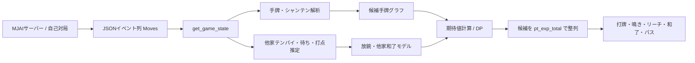

# Akochan の仕組み

この文書は、麻雀 AI を初めて読む人に向けて、Akochan が「現在の局面」から「次の行動」を決めるまでを説明します。前半で麻雀とコードの基本を、後半で候補生成、確率推定、動的計画法、押し引き、順位期待値までを扱います。

説明は現在のソースコードを基準にしています。`params/` にある重みの**学習処理や学習データはこのリポジトリに含まれません**。したがって、学習方法ではなく、固定済みの重みを実行時にどう使うかを解説します。

## 詳細文書への案内

この文書は全体の地図です。前提や個別仕様を深掘りするときは、[docs/README.md](README.md) の案内と、次の4文書を参照してください。

| 目的 | 詳細文書 |
|---|---|
| 牌表現、状態復元、役・符・点数、合法手 | [02-state-rules-scoring.md](02-state-rules-scoring.md) |
| ビルド、CLI、自己対局、MJAI、ログ運用 | [03-runtime-and-mjai.md](03-runtime-and-mjai.md) |
| 手牌候補、探索グラフ、DP、押し引き、最終行動 | [04-ai-search-and-decision.md](04-ai-search-and-decision.md) |
| 聴牌・待ち・打点・流局・順位モデル、パラメータ | [05-models-evaluation-and-parameters.md](05-models-evaluation-and-parameters.md) |

初めて読む場合は、全体像を本書で掴んだ後、運用は03、探索は04、統計モデルは05、共有層のルールは02の順に読むと、入力イベントから最終行動までを追いやすくなります。

## 1. 麻雀 AI が解く問題

### 1.1 麻雀の最小限のルール

麻雀は4人で行い、各プレイヤーは通常13枚を持ちます。自分の番に1枚をツモり、14枚から1枚を捨てます。基本の和了形は「3枚組を4組＋同じ牌2枚の雀頭」です。3枚組には、同じ牌3枚の刻子と、同じ種類の連番3枚の順子があります。七対子のような例外形もあります。

主な行動は次の通りです。

| 用語 | 意味 |
|---|---|
| ツモ / 打牌 | 山から1枚引く / 1枚捨てる |
| チー | 直前の上家の捨て牌で順子を作る |
| ポン | 他家の捨て牌で刻子を作る |
| 槓 | 同じ牌4枚をまとめる。暗槓・加槓・大明槓がある |
| リーチ | 門前で聴牌したことを宣言し、1000点を供託する |
| ロン / ツモ和了 | 他家の捨て牌 / 自分のツモで和了する |
| 流局 | 誰も和了せず、その局が終わる |
| 放銃 | 自分の捨て牌で他家にロンされる |
| フリテン | 自分の待ち牌を過去に捨てた等の理由でロンできない状態 |

「シャンテン数」は一般には和了までに必要な改善段階で、`-1` が和了、`0` が聴牌、`1` が1シャンテンです。「受け入れ」は、引いたときにシャンテン数を下げる牌種と、その残り枚数を指します。ただしAkochanでは、共有層の `mentu_shanten_num` とAI側 `Tehai_Analyzer` の値で計算経路・意味が異なります。実装上の範囲は [状態・ルール文書](02-state-rules-scoring.md) と [AI探索文書](04-ai-search-and-decision.md) を参照してください。

### 1.2 最短の和了だけでは不十分

良い行動は、単に受け入れが最大の打牌とは限りません。高い手を作る価値、他家に放銃する危険、流局時のテンパイ料、現在の点数と残り局数、1位を守る価値などが競合するためです。

Akochan は最終的に、各行動の結果をデフォルトで次の順位点へ換算します。

```text
1位: +90    2位: +30    3位: -30    4位: -90
```

そして、将来得られる**順位点の期待値** `pt_exp_total` が最大の行動を選びます。局中の打点期待値だけを最大化する AI ではありません。

## 2. 全体構成



| 場所 | 主な責務 |
|---|---|
| [`main.cpp`](../akochan/main.cpp) | CLI、自己対局、MJAIクライアントの起動 |
| [`mjai_manager.cpp`](../akochan/mjai_manager.cpp) | 山・配牌・ツモ・鳴き・和了・流局・次局の進行 |
| [`share/types.*`](../akochan/share/types.hpp) | 牌、手牌、副露、局面、イベント列の共通型 |
| [`share/make_move.*`](../akochan/share/make_move.hpp) | MJAI形式の行動生成と合法性検査 |
| `share/calc_*` | [待ち](../akochan/share/calc_shanten.cpp)、[役](../akochan/share/calc_agari.cpp)、[符](../akochan/share/calc_yaku.cpp)、[点数移動](../akochan/share/agari_ten.cpp) |
| [`ai_src/selector.cpp`](../akochan/ai_src/selector.cpp) | 推定値を統合し、最終行動を選ぶ入口 |
| [`ai_src/tehai_*.cpp`](../akochan/ai_src/tehai_cal.cpp) | 手牌解析、候補列挙、遷移グラフ、DP |
| [`ai_src/tenpai_*.cpp`](../akochan/ai_src/tenpai_est.cpp) | 他家の聴牌・待ち・打点・放銃推定 |
| [`ai_src/exp_values.cpp`](../akochan/ai_src/exp_values.cpp) | 局結果の確率と順位価値の合成 |
| [`params/`](../akochan/params) | ロジスティック回帰や softmax の固定済み重み |

ルート側と AI 側は [`import.hpp`](../akochan/import.hpp) の `ai()`、`set_tactics()`、`calc_moves_score()` などで接続されます。Linux では `ai_src` が `libai.so` になり、実行ファイルはリンク時に `-lai` で接続します。実行時に `dlopen()` するプラグイン方式ではありません。

## 3. 局面をどう表現するか

### 3.1 すべての出来事は `Moves` に積む

`Moves` は `std::vector<json11::Json>` で、`start_kyoku`、`tsumo`、`dahai`、`reach`、`chi`、`hora` などを時系列に保持します。AI は可変の盤面オブジェクトだけを受け取るのではなく、原則としてこのイベント列を受け取ります。

`get_game_state()` は、末尾から最新の `start_kyoku` を探し、そこからイベントを再生して `Game_State` を復元します。`Game_State` は場風、局、本場、供託、ドラ表示牌、4人分の `Player_State` を持ちます。各プレイヤーの状態には点数、自風、手牌、副露、河、リーチ状態が入ります。

この設計により、自己対局、棋譜再生、MJAI通信が同じ状態復元処理を利用できます。

### 3.2 牌の番号

手牌は38要素の `Hai_Array` で数えます。添字0は使わず、次の番号を用います。

```text
1..9    萬子
11..19  筒子
21..29  索子
31..37  東・南・西・北・白・發・中
10/20/30  赤5萬・赤5筒・赤5索
```

`haikind()` は赤5を通常の5へ正規化します。これにより牌種としては同じ5として比較しつつ、赤ドラかどうかを別に保持できます。

## 4. 自己対局エンジン

`./system.exe test 100 102` は `setup_match.json` を読み、指定 seed ごとに `game_loop()` を実行します。1局は概ね次のイベント列になります。

```text
start_game
  → start_kyoku（点数・配牌・ドラ・山）
  → 親の tsumo
  → AIの行動
  → dahai / 鳴き / 次の tsumo を反復
  → hora または ryukyoku
  → end_kyoku
  → 次局、または end_game
```

`prepare_haiyama()` は136枚の物理牌を `std::shuffle` し、内部の38種類表現へ変換します。最初の52枚を4人の13枚配牌に使い、通常ツモはその後ろから、嶺上ツモは山の末尾側から取ります。通常ツモと嶺上ツモの合計は最大70回です。初期ドラ表示牌は末尾から6枚目を使います。

捨て牌または加槓の後は、[`add_move_after_dahai()`](../akochan/mjai_manager.cpp) が次の優先順で進めます。

1. 他家のロン
2. 最終ツモ後なら流局
3. 加槓後なら嶺上ツモ
4. ポン
5. 大明槓
6. 下家のチー
7. 次プレイヤーのツモ

ロン候補は放銃者からの座順で3人すべてを走査し、該当する `hora` を順に追加します。ただし各 `scores` はそれ以前に追加した `hora` の支払いを累積せず、次の進行では末尾の `hora` が基準になります。このため複数ロンの点棒処理は一般的な同時和了処理と同じではありません。

合法手の列挙自体は [`get_all_legal_moves()`](../akochan/share/make_move.cpp) が担当し、打牌、ポン＋打牌、チー＋打牌、各種の槓、リーチ＋打牌、ツモ和了、ロン、パスを作ります。リーチは門前、1000点以上、未リーチ、最終巡ではない、打牌後に聴牌、という条件を検査します。

## 5. AI が1手を決める処理

公開入口は [`ai()`](../akochan/ai_src/selector.cpp) です。中心となる `Selector::set_selector()` の流れを単純化すると次のようになります。

```text
入力: game_record, 自分の player id

1. イベント列から現在局面を復元する
2. 自分の手牌を分解し、シャンテン・待ち・和了形を求める
3. 他家ごとに聴牌率、待ち牌、翻・符の分布を推定する
4. 現在および将来の手牌候補をグラフとして列挙する
5. 各候補について和了、流局、他家和了、放銃、降りを評価する
6. 各局結果後の最終順位確率を求め、順位点期待値へ変換する
7. 自分のツモなら Hai_Choice、他家の打牌なら Fuuro_Choice を作る
8. pt_exp_total の降順に並べ、先頭を返す
```

入力として通常処理する直前イベントは、自分の `tsumo`、他家の `dahai`、他家の `kakan` です。

## 6. 手牌解析と候補生成

### 6.1 シャンテン数

[`Tehai_Analyzer`](../akochan/ai_src/tehai_ana.cpp) は、刻子、順子、対子、両面・嵌張などのターツ、孤立牌を再帰的に分解します。通常形の基本式は次です。

```text
通常形 = 8 - 2 × (完成面子数 + 副露数) - ターツ数 - 雀頭数
```

4面子に達した場合などには余剰牌条件による補正が入ります。七対子は次です。

```text
tmp = 13 - 2 × 対子数 - min(7 - 対子数, 孤立牌種類数)
七対子 = max(0, tmp)
```

最終値は通常形と七対子の小さい方です。受け入れ牌種は、牌種を1枚ずつ仮に加えてシャンテンが下がるかで判定します。候補評価での残り枚数は、`4 - 候補状態で使用中の枚数 - 手牌外で見えている枚数` を基本とし、現在状態の使用枚数が候補より多い場合はその差も差し引きます。

### 6.2 高シャンテン時のルールベース分岐

探索量を抑えるため、次の場合は完全な候補グラフを作らず `rule_base_decision` を使います。

```text
リーチ中ではなく、
  総合シャンテンが4以上
  または（通常形が5以上 かつ 七対子が3以上）
```

自分のツモ時は孤立牌のヒューリスティックまたはベタオリを選び、他家の捨て牌には鳴かず `FUURO_PASS` を返します。九種九牌が有効かつ合法なら、それを優先する分岐もあります。

### 6.3 候補手牌グラフ

通常探索では [`Tehai_Calculator`](../akochan/ai_src/tehai_cal.cpp) が、現在の手牌から到達可能な手牌状態を列挙します。

- 副露応答候補ではない14枚状態では、各牌を1枚抜いた打牌後状態を根候補にする
- 13枚状態では、1枚引いて1枚捨てる交換を列挙する
- 通常形と七対子について、複数枚の手替わりも列挙する
- 同じ `Tehai_Change` はハッシュ集合で重複除去する
- 候補総数の上限は `200,000`
- 1候補グループの `ta_loc` に持てる手牌解析状態は最大 `128`

リーチ中は通常の手替わり候補を列挙しません。各ノードは牌の枚数だけでなく、チー位置、ポン、暗槓、明槓、リーチ、赤牌の内外をビットで持ちます。候補グラフはツモ・打牌・鳴き・槓の遷移を持ち、リーチはリーチフラグ付き状態への遷移として表現します。和了形は別の `agari_graph_work` に保存します。

デフォルトでは、現在の通常形シャンテン数に `tegawari_num = [2,2,1,1,0,0,0]` を足した範囲まで手替わりを検討します。候補優先度は、`honitsu_check == 1` なら `+2`、`toitoi_check == 1` なら `+2`、`tanyao_check == 1` なら `+1`、さらに `yakuhai_check` と残存組合せ確率を加えた値です。`honitsu_check` は清一色も通り、場風と自風が同じ役牌は二重加点され得ます。

グラフ構築時には、リーチ後は暗槓以外を禁止する、鳴いた牌と同種を直後に捨てない、食い替えを禁止する、などの制約も適用します。

## 7. 他家をどう推定するか

他家の手牌は見えないため、Akochan は「聴牌している確率」「どの牌が当たるか」「当たったとき何点か」を分けて推定します。

### 7.1 聴牌確率

リーチ者の聴牌率は `1.0` です。デフォルトの `ako` モデルでは、非リーチ者についてロジスティック回帰を使います。

```text
P(聴牌) = σ(w·x) = 1 / (1 + exp(-Σ wi xi))
```

通常手モデルの主な特徴は、定数項、手出し枚数、他家リーチ後の打牌数、捨てた么九牌の種類数、中張牌の種類数です。鳴き数と河の長さに応じて異なる `params/tenpai_prob/...` を選びます。鳴き0ではこの通常手モデルの出力を最大 `0.12` に制限し、鳴き4では `1.0` とします。

混一色・清一色を狙っている可能性は色ごとに別モデルで推定し、通常手と染め手の混合確率として最終聴牌率を作ります。染め手成分は1副露以上でだけ加わるため、鳴き0の最終値も `0.12` 以下です。

### 7.2 待ちと打点

非リーチで1副露以上の相手では、見えていない手牌の組合せを再帰列挙します。仮想手牌の重みは、牌種ごとの残り枚数に対する組合せ数の積です。生成された和了形情報が2件未満なら重みを `0.2` 倍し、すでに見逃した牌を待ちに含む候補や役なし候補を除きます。

最終的に、相手・牌・翻・符ごとのロン推定量を作り、各牌について次を計算します。

```text
放銃確率[相手][牌] = Σ 翻,符 P(牌, 翻, 符)

放銃時価値[相手][牌]
  = Σ P(牌, 翻, 符) × その局終了後の順位価値
    / 放銃確率[相手][牌]
```

副露手の列挙側では、まず牌の組合せ重みを列挙候補内で正規化します。`ako` の `normalize2` は通常手・各染め手成分を、それぞれの重みを**総聴牌率で割った条件付き構成比**に変換します。そのため、`cal_total_houjuu_hai_prob_value` で `tenpai_prob` を掛けるのは、条件付き分布を無条件量へ戻すための1回だけであり、「列挙側と総量側で聴牌率を二重に掛ける」経路ではありません。一方、待ち形の係数は両面の2端や双碰の2待ちを含む発生量で、すべての牌別配列が確率1へ正規化されるわけではありません。複数相手に対する総放銃確率は相手間の独立性補正をせず単純加算し、`1.0` で上限処理します。

### 7.3 主な統計モデル

| モデル | 目的 | 主な出力 |
|---|---|---|
| `tenpai_prob` | 現在の他家聴牌推定 | 聴牌確率 |
| `tenpai_after` | 数巡後の他家状態 | 将来聴牌確率 |
| `other_end_prob` | 途中で他家が和了する可能性 | 巡ごとの局終了確率 |
| `houjuu_prob` | 和了者と放銃者の分配補正 | 誰からロンするか |
| `ryukyoku_prob` | 山が尽きる可能性 | 流局確率 |
| `tsumo_num` | 自分に残る手番 | 期待ツモ回数 |
| `my_keiten` / `other_keiten` | 流局時の形式聴牌 | テンパイ確率 |
| `rank_prob` | 点数状況と残り局数から順位を推定 | 4人×4順位の確率 |
| `betaori` | 降り続けた場合を補正 | 放銃確率・降り期待値 |

ここで `houjuu_prob` は牌ごとの危険度モデルではありません。牌別危険度は待ち・翻・符の推定分布から作ります。`cal_target_prob()` は、ある他家が和了したときのロン対象を分配します。`instant` は和了者自身（ツモ相当）を `5/11`、他の3人へのロンを各 `2/11` とします。`ako` では河4枚以下で自分への確率を `2/11` に固定し、それ以降は `[1, risk_array, 自分の副露数]` を用意しますが、現行呼び出しは特徴数2なので副露数を実際には使いません。残余を和了者自身 `5/9`、それ以外 `2/9` へ配ります。

実行時補正の代表例は次の通りです。

- 探索で得た生の和了確率は `cal_my_agari_prob()` で補正する。`ako` は定数、他家リーチ数、非リーチ他家の「少なくとも1人が聴牌」の確率、生和了確率の logit という4特徴のロジスティック回帰を使う。条件のよい序盤門前ツモ局面では生値をそのまま返し、`instant` は生値の `0.5` 倍とする。
- 流局確率は `n = 自分の河枚数 + dahai_inc` とし、`instant` なら `1 - 0.75 × max(18 - n, 0) / 18`。`ako` は同じ `n`、他家リーチ人数の区分、非リーチ他家の聴牌確率を4重みで回帰する。
- 自分の形式聴牌は、リーチ中なら `1.0`、`instant` なら探索値の `0.6` 倍、`ako` なら探索値と他家リーチ有無を3重みで補正する。他家の形式聴牌はリーチ中 `1.0`、`instant` は `0.5`、`ako` は現在聴牌率を2重みで補正する。
- 他家の和了者分布 `result_other` は、相対座順ごとのリーチ有無と聴牌率を含む7特徴、21重み、3クラス softmax で求める。
- 将来聴牌率 `tenpai_after` の `instant` は現在値を維持する。`ako` は現在・将来の河枚数でファイルを選び、`[1, logit(現在聴牌率)]` の2重みで回帰する。他家に1人でもリーチ者がいれば、現行コードは無条件にリーチ用推定へ置換します。対応する設定JSONのキーは参照されません。
- 巡中の他家和了終了率 `other_end_prob` は、`instant` なら各巡 `0.1`。`ako` は現在・将来の河枚数で3重みファイルを選び、`[1, 他家リーチ人数, 非リーチ他家の少なくとも1人が聴牌する確率]` を回帰する。
- `rank_prob` は4特徴、96重み、24着順クラス、和了確率補正 `agari_prob` は4重み、`betaori` 補正は3重みを使う。

## 8. 動的計画法と期待値

### 8.1 いつ DP を使うか

`cal_dp_flag()` は、デフォルトで次のシャンテン閾値以内ならリスク込み DP を使います。

| 状況 | 閾値 |
|---|---:|
| 常時 | 1シャンテン以下 |
| 他家リーチ中 | 2シャンテン以下 |
| 鳴き判断中 | 1シャンテン以下 |
| 他家リーチ中の鳴き判断 | 2シャンテン以下 |

副露後の和了シャンテン数にも別途同じ閾値判定を適用します。DP を使わない場合も `calc_agari_prob()` が将来ツモを反復計算しますが、リスク統合の詳細が異なります。

DPでは、実際の進行から求めた残りツモ回数をそのまま使います。非DPでは、この実進行値と統計モデルの推定値の小さい方を使います。実進行値は概ね次です。

```text
base = (70 - 全員のツモ数（通常＋嶺上）) / 4
残りの順番が自分まで回るなら base + 1
```

### 8.2 牌ごとの最良遷移

各候補状態は、和了確率 `agari_prob`、聴牌確率 `tenpai_prob`、和了時期待値 `agari_exp`、総合期待値 `ten_exp`、降り期待値 `ori_exp` などを持ちます。

実装は `tn=0` を終端として初期化し、`tn=1..tsumo_num` と終端側から現在側へ後退解析します。引き得る牌 `h` ごとに、その牌から可能なツモ・暗槓・加槓側の遷移と、ロン・ポン・チー・大明槓側の遷移を段階別に比較し、主に `ten_exp` が最大の遷移を採ります。その後、牌の残存確率で加重平均します。`tenpai_prob` などは価値とまったく同じ比較だけでなく、独立した改善値も更新します。

```text
q(h, tn) = (4 - 候補状態で使用中の枚数 - 手牌外で見えている枚数
               - max(0, 現状態の使用枚数 - 候補状態の使用枚数))
           / (nokori_hai_num - (tsumo_num - tn))

V(state, tn)
  ≈ Σh q(h, tn) × best_transition_value(state, h, tn - 1)
```

これは処理を要約した概念式です。実コードは赤牌、候補間の使用牌差、`rn_para`、鳴き成立機会も補正します。「同じ牌を引いた後にどの牌を切るか」も遷移比較に含まれるため、`agari_prob` は無条件の牌山確率ではなく、期待値最大方策を選び続けたときの和了確率です。

### 8.3 放銃と他家和了を混ぜる

ある打牌の放銃確率を `p`、放銃しない場合の次状態価値を `Vnext`、放銃時価値を `Vdeal` とすると、打牌価値は次です。

```text
Vdiscard = (1 - p) × Vnext + p × Vdeal
```

さらに、その巡で他家が和了して局が終わる確率 `e` と、その価値 `Vother` を混ぜます。

```text
V = e × Vother + (1 - e) × Vdiscard
```

ポン・ロンによる分岐の成立機会も補正します。`ron_ratio_est="instant"` では `1 + 2 × pon_ron_flag` を使います。リポジトリのデフォルトである `"ako"` では、ポン側は同じ基礎係数、ロン側は門前ダマの牌種別固定比、または自分・他家の聴牌率と牌別危険度を入力するロジスティック回帰のオッズへ切り替えます。

### 8.4 ベタオリ

ベタオリは、和了を諦め、安全な牌から切って放銃を避ける方策です。[`Betaori`](../akochan/ai_src/betaori.cpp) は手牌中の牌を危険度順に並べます。牌 `h` を `n` 枚持ち、放銃確率を `p`、放銃時価値を `Vh`、放銃しない価値を `Vo` とすると、並べ替え係数は次です。

```text
β = 1 - 0.9^n

risk = p × (Vo - Vh) / (p + β - p×β)
```

安全側から必要枚数を切る過程で連続非放銃確率を更新し、最後まで降りた期待値を求めます。DP 内での置換は、`ori_choice_mode > 0`、未リーチ、`ori_exp > ten_exp`、さらに `use_ori_exp_at_dp_fuuro` が有効または候補の副露数が現在と同じ場合に限ります。このとき和了・聴牌確率を0として降り方策を採ります。非DPの自分のツモ局面では、他家リーチ中または他家の最大副露数が2以上のとき、攻撃期待値とベタオリ期待値の大きい方を使います。他家打牌局面ではこの比較をしません。

## 9. 局結果を順位価値へ変える

最終評価 [`cal_exp()`](../akochan/ai_src/exp_values.cpp) は、自分の和了、3人それぞれの和了、流局という5種類を合成します。

```text
E = Σi P(局結果 i) × Value(局結果 i)
```

和了時は翻1〜13、符を列挙し、親子、ロン・ツモ、本場、供託を含む実際の点棒移動を求めます。流局時は4人の聴牌・ノーテン16通りを列挙し、1人聴牌なら `+3000/-1000`、2人なら `+1500/-1500`、3人なら `+1000/-3000` を反映します。

その局終了後の点数から [`calc_jun_prob()`](../akochan/ai_src/jun_calc.cpp) が最終順位確率を推定します。`jun_est="ako"` で局・点数条件を満たす場合、親と局番号から求めた相対座順へ4人を並べ替え、先頭者と残り3人の点差を1万点単位にした3特徴と定数項を使い、24通りの着順順列へ softmax を適用します。

```text
x = [1,
     (relative_score0-relative_score1)/10000,
     (relative_score0-relative_score2)/10000,
     (relative_score0-relative_score3)/10000]

P(class c) = exp(wc·x) / Σj exp(wj·x)
```

各順列の確率を実プレイヤーの順位確率へ戻し、順位点 `[90, 30, -30, -90]` を掛けます。`jun_est="instant"`、親の連荘終了で最終順位が確定する場合、またはモデルの局・点数条件外では、点数順と起家基準の同点順で決定的な順位を返します。これにより、同じ8000点の和了でも、東1局と南4局、トップ目とラス目では行動価値が変わります。

なお、探索の生和了確率を補正した後も、探索値 `value_sol` はそのまま捨てません。和了時価値を

```text
my_agari_value
  = (value_sol - (1 - raw_agari_prob) × value_not_agari)
    / raw_agari_prob
```

と分離し、補正後の和了確率と再合成します。生和了確率が0なら和了時価値も0です。

## 10. 行動別の最終選択

### 自分がツモったとき

高シャンテンの `rule_base_decision` はDP判定より前に終了し、ルールベース打牌、ベタオリ、または九種九牌を返します。それ以外の通常探索でDPを使うツモ局面では、次を `Hai_Choice` として比較します。

- 通常の打牌
- リーチ宣言＋打牌
- ツモ和了
- 設定で許可された暗槓・加槓

明示的な `AT_TSUMO_AGARI` はDP分岐でだけ生成されます。ツモ牌が和了牌と一致し、候補生成上のハイテイ等を含めて1翻以上ある場合だけ作ります。リーチ候補は1000点以上で、通常ツモと嶺上ツモの合計が66以下などの条件を満たす必要があります。非DP分岐では通常打牌、リーチ、設定に応じた槓を評価します。

### 他家が捨てた、または加槓したとき

DPを使う他家打牌局面では、次を `Fuuro_Choice` として比較します。

- ロン
- パス
- ポン＋直後の打牌
- チー＋直後の打牌
- 大明槓

明示的な `AT_RON_AGARI` もDP分岐でだけ生成されます。ロンでは待ち、役、フリテン、同巡フリテンを検査します。鳴き候補は鳴いた後の打牌についても放銃リスクを評価します。直前イベントが加槓なら、DPでもロンとパスだけを比較し、槍槓の1翻を加えるため元の手に役がなくても候補になれます。非DPの他家打牌分岐はパスと鳴き、非DPの加槓分岐とルールベース分岐はパスだけです。この限定は、非DPとなる高シャンテン局面では通常ロン形にならない、という探索設計を前提にしています。

最後に候補を `pt_exp_total` の降順で並べます。`ai()` は先頭候補を MJAI JSON に変換します。リーチは `[reach, dahai]`、チーやポンは `[副露, dahai]` の2イベントを返すため、MJAIクライアントは1つ目が受理された後に保存済みの2つ目を送ります。

## 11. MJAI と外部実行

MJAI モードでは [`TcpClient`](../akochan/mjai_client.cpp) が1行1 JSONで通信します。`hello` には `join` を返し、`start_game` で自分のIDを保存します。自分の `tsumo`、または `possible_actions` がある他家の `dahai` で `ai()` を呼びます。`hora`、`ryukyoku` など、応答行動がないイベントには `none` を返します。

設定は `setup_match.json` または `setup_mjai.json` から `set_tactics()` / `set_tactics_one()` へ渡されます。読み取り経路は2つあります。`Tactics::set_from_json()` は `default`、`light`、`minimum` の基底設定を選び、順位点、槓、DP内の降り、翻分布、`betaori_est` などを構造体へ写します。一方、`jun_est`、`tenpai_prob_est`、`agari_prob_est`、`ron_ratio_est` 等はAI各所が共有 `tactics_json` を直接参照します。設定を追加するときは両方の経路を確認する必要があります。

TCPクライアントとは別に、`mjai_manager.cpp` の `game_server()` は `my_pid=0` 固定の独立したJSON一手APIを提供し、適用後の `new_moves`、`msg_type`、`legal_moves` を返します。`main.cpp` の `pipe` は標準入力のMJAIイベント列から直接 `ai()` を、`pipe_detailed` は直接 `ai_review()` を呼ぶ別のアダプタです。

## 12. `params/` と学習の境界

パラメータはプレーンテキストの浮動小数点列です。推論関数が相対パスから必要個数を読み、個数不足やファイル不在では `assert` で停止します。そのため通常は `akochan/`（`system.exe` と `params/` があるディレクトリ）をカレントディレクトリにして実行する必要があります。

コードで確認できるのは、固定重みを使う二値ロジスティック回帰と多クラス softmax の推論です。重みがどの学習手法で得られたかは確認できません。ファイル名の `_4000`、`_9000` 等を実行時コードが学習件数として解釈することはありません。また、`_nn` という名前の順位モデルも、実行時には96重み・24クラスの線形 softmax として扱われます。ニューラルネットワーク推論はありません。

## 13. 現行実装を読む際の注意

アルゴリズムを再実装・変更する場合は、理想的な麻雀ルールと現行コードの挙動を区別してください。

- `mjai_manager` は複数のロン候補をすべてイベントへ追加しますが、各支払いを累積した最終点数にはしません。一般的な複数同時ロンの精算とは異なります。
- MJAIアクションの一部の `is_valid_*` は `type` と一部フィールド（`consumed` の枚数や牌種関係など）だけを確認し、完全な JSON Schema 検証ではありません。
- `is_legal_chi/pon/daiminkan()` の直前牌比較は、文字列の牌へ `int_value()` を呼んでおり、意図した同一牌比較としては機能しません。合法候補生成と受信行動検証は同じ強さではありません。
- `is_legal_hora()` は入力アクションの `target` と直前打牌者を直接比較しません。また、現在の和了牌だけでなく全待ちを走査し、いずれかがフリテンならロン全体を拒否します。
- ハイテイは合法性検査とAI候補生成では1翻として扱いますが、自己対局の `mjai_manager` による和了点計算では `han_add` へ加算されません。
- `setup_mjai.json` にキーを書くだけでは有効になりません。`Tactics::set_from_json()` またはAI各所の `tactics_json` 参照がそのキーを読むか確認してください。
- [`pseudo_game.cpp`](../akochan/pseudo_game.cpp) は、`PG_Kyoku_Init`（場風・局・本場・供託・点数）と `PG_Kyoku_Result`（和了者・放銃者・翻符・流局時状態）だけで進む別系統の簡略シミュレータです。6種類の確率ファイルからツモ和了・ロン・流局等を抽選し、実牌を進行させず次局の開始情報を生成します。現行 `main.cpp` から呼ばれる CLI はなく、`get_next_kyoku_init` はヘッダの2引数宣言と実装の `game_rule` 付き3引数が一致していません。
- 学習データ、重みの生成手順、精度指標はリポジトリ内にありません。モデルの統計的妥当性は、推論コードだけからは判断できません。

## 14. ソースを読む順序

実装を追う場合は、次の順序が理解しやすいです。

1. [`share/types.hpp`](../akochan/share/types.hpp) で牌・局面・イベント型を確認する
2. [`share/types.cpp`](../akochan/share/types.cpp) の `get_game_state()` で状態復元を見る
3. [`ai_src/selector.cpp`](../akochan/ai_src/selector.cpp) の `ai()` と `set_selector()` で全体フローを見る
4. [`ai_src/tehai_ana.cpp`](../akochan/ai_src/tehai_ana.cpp) でシャンテン解析を見る
5. [`ai_src/tehai_cal.cpp`](../akochan/ai_src/tehai_cal.cpp) と `tehai_cal_supl.cpp` で候補グラフと DP を見る
6. [`ai_src/tenpai_est.cpp`](../akochan/ai_src/tenpai_est.cpp) と `tenpai_prob_calc.cpp` で他家推定を見る
7. [`ai_src/exp_values.cpp`](../akochan/ai_src/exp_values.cpp) と [`ai_src/jun_calc.cpp`](../akochan/ai_src/jun_calc.cpp) で順位期待値への変換を見る
8. [`mjai_manager.cpp`](../akochan/mjai_manager.cpp) と [`mjai_client.cpp`](../akochan/mjai_client.cpp) で実行環境との接続を見る

この順序なら、「イベントから局面を作る」「候補を作る」「未知情報を確率化する」「将来価値を逆算する」「行動へ戻す」という Akochan の一連の設計をコードと対応させて追えます。
